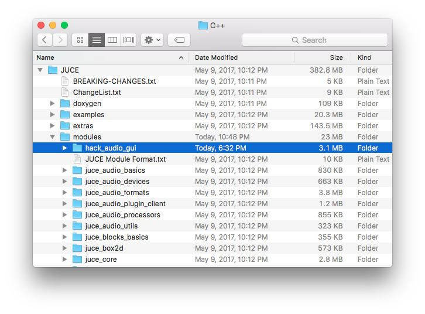
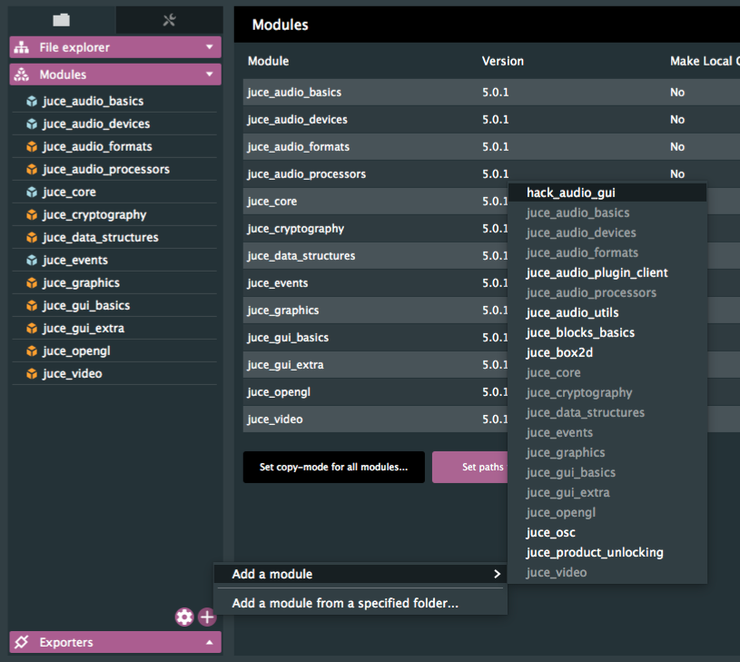

# HackAudio GUI

This module provides the custom GUI components used in HackAudio software.

## Installation

Simply clone this repository into the `modules` folder of your JUCE installation, and include the module in your JUCE projects using the Projucer!

## Features

HackAudio GUI customizes the following JUCE components:
- Sliders
- Toggle Buttons
- Labels

While adding the following new components:
- Selectors
- Viewport/Diagrams
- Meters

Check the wiki for full documentation!

## Requirements

This module requires at least JUCE v4.0 to be used.

## License

Copyright (C) 2017 by Antonio Lassandro, HackAudio LLC

hack_audio_gui is provided under the terms of The MIT License (MIT):

Permission is hereby granted, free of charge, to any person obtaining a copy of this software and associated documentation files (the "Software"), to deal in the Software without restriction, including without limitation the rights to use, copy, modify, merge, publish, distribute, sublicense, and/or sell copies of the Software, and to permit persons to whom the Software is furnished to do so, subject to the following conditions:

The above copyright notice and this permission notice shall be included in all copies or substantial portions of the Software.

THE SOFTWARE IS PROVIDED "AS IS", WITHOUT WARRANTY OF ANY KIND, EXPRESS OR IMPLIED, INCLUDING BUT NOT LIMITED TO THE WARRANTIES OF MERCHANTABILITY, FITNESS FOR A PARTICULAR PURPOSE AND NONINFRINGEMENT. IN NO EVENT SHALL THE AUTHORS OR COPYRIGHT HOLDERS BE LIABLE FOR ANY CLAIM, DAMAGES OR OTHER LIABILITY, WHETHER IN AN ACTION OF CONTRACT, TORT OR OTHERWISE, ARISING FROM, OUT OF OR IN CONNECTION WITH THE SOFTWARE OR THE USE OR OTHER DEALINGS IN THE SOFTWARE.

### Fonts

This software contains embedded fonts [Now](docs/now/LICENSE) and [Baumans](docs/baumans/LICENSE), whose licenses are located within the [docs](docs/) folder.
